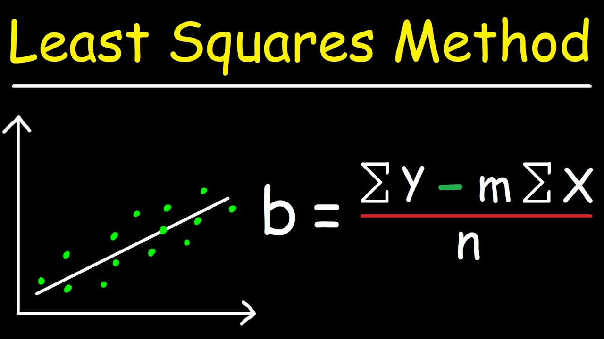

# 2.10) RIDGE REGRESSION

- It is a regression type of linear model.
- It uses the least squares formula to find regression.
- In this regression coefficients are not chosen only they predicted well on training data.
- If we want coefficients must be very small/close to each other it is useful.
- Regularization is explicitly restricting model to avoid overfitting.
- The particular kind used by ridge regression is known as l12 regularization.



```python
from mglearn.datasets import load_extended_boston
from sklearn.model_selection import train_test_split

from sklearn.linear_model import Ridge

ridge = Ridge(alpha=1)
X, y = load_extended_boston()
X_train, X_test, y_train, y_test = train_test_split(X, y, random_state=0)

ridge.fit(X_train, y_train)
print("Training score is %{:.2f} ".format(ridge.score(X_train, y_train) * 100))
print("Test score is %{:.2f} ".format(ridge.score(X_test, y_test) * 100))
# Output => Training score is %89
# Output => Training score is %75
```

- Ridge regression makes a trade of between the simplicity of the model and its performance on the training set.
- Importance using simplicity setting in ridge is quite understandable and setting can be managed by alpha parameter in
  ridge regressor.
- Playing with alpha gives different results according to the dataset.

```python
# Changing the alpha
ridge01 = Ridge(alpha=0.1)
ridge01.fit(X_train,y_train)
print("Training score is %{:.2f} ".format(ridge01.score(X_train, y_train) * 100))
print("Test score is %{:.2f} ".format(ridge01.score(X_test, y_test) * 100))
#Output=> Training score is %92.82 
#Output=> Test score is %77.22 
```
<hr>
2022@CANROLLAS | CANROLLAS@gmail.com
<hr>


