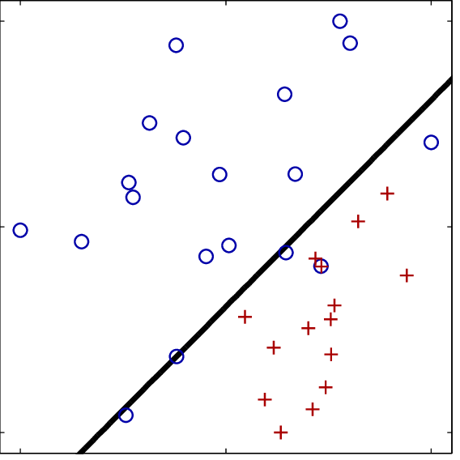

# LINEAR MODEL FOR CLASSIFICATION

- Linear models are the most common models in machine learning.
- let's look at the binary classification in linear models.
- Y = w[0]*X[0] + w[1]*X[1] + w[2]*X[2] + ... + w[n]*X[n] + b > 0
- This function makes if the weighted sum of the all bigger zero returns 1
- Else returns marks as -1.
- Türkce olarak: Bir sınıflandırma probleminde cekilen cizginin iki grubu sınıflandırmada baz alınabilecegi yönündedir.



```python

import matplotlib.pyplot as plt
import mglearn.datasets
from sklearn.linear_model import LogisticRegression
from sklearn.svm import LinearSVC

X, y = mglearn.datasets.make_forge()
fig, axes = plt.subplots(1, 2, figsize=(10, 3))
for model, ax in zip([LinearSVC(), LogisticRegression()], axes):
    print("Model:", model, " ax:", ax)
    clf = model.fit(X, y)
    mglearn.plots.plot_2d_separator(clf, X, fill=False, eps=0.5, ax=ax, alpha=.7)
    mglearn.discrete_scatter(X[:, 0], X[:, 1], y, ax=ax)
    ax.set_title(model)
    ax.set_xlabel("Feature 0")
    ax.set_ylabel("Feature 1")

fig.show()
axes[0].legend()
```

### LOGISTIC REGRESSION

- Logistic regression estimates the probability of an event occurring, such as voted or didn't vote, based on a given
  dataset of independent variables. Since the outcome is a probability, the dependent variable is bounded between 0 and 1.

### SVM LINEAR REGRESSION

- Support Vector Machine or SVM is one of the most popular Supervised Learning algorithms, which is used for
  Classification as well as Regression problems. However, primarily, it is used for Classification problems in Machine
  Learning.


###### Note: Trade off parameter is C in SVM and Logistic regressions.

### What is overfitting?
Overfitting is a phenomenon which occurs when a model learns the detail and noise in the training data to an extent that it negatively impacts the performance of the model on new data.

So the overfitting is a major problem as it negatively impacts the performance.

Regularization technique to the rescue.

Generally, a good model does not give more weight to a particular feature. The weights are evenly distributed. This can be achieved by doing regularization.

There are two types of regularization as follows:

L1 Regularization or Lasso Regularization
L2 Regularization or Ridge Regularization
L1 Regularization or Lasso Regularization
L1 Regularization or Lasso Regularization adds a penalty to the error function. The penalty is the sum of the absolute values of weights.


p is the tuning parameter which decides how much we want to penalize the model.


L2 Regularization or Ridge Regularization
L2 Regularization or Ridge Regularization also adds a penalty to the error function. But the penalty here is the sum of the squared values of weights.


Similar to L1, in L2 also, p is the tuning parameter which decides how much we want to penalize the model.

This is Regularization. That's it for now.