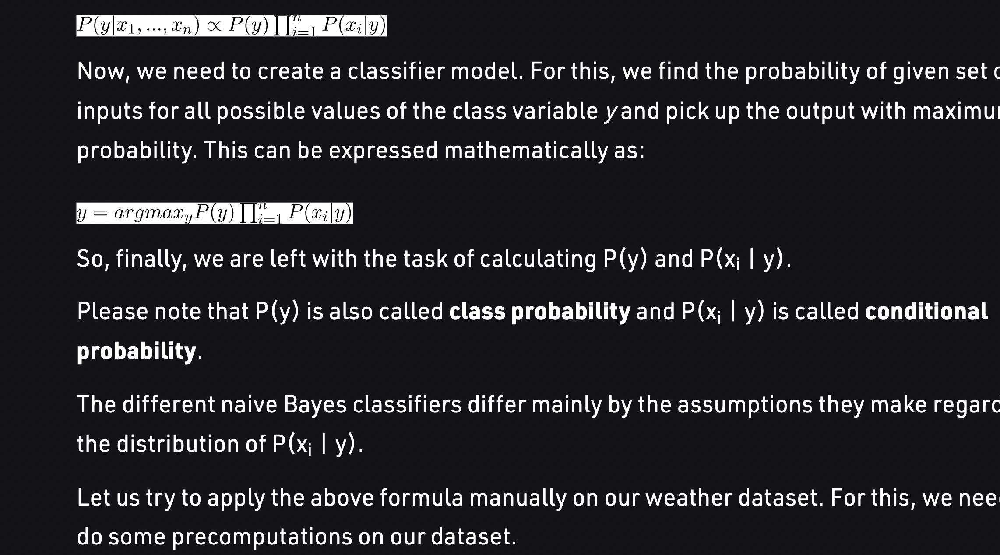

# NAIVE BAYES CLASSIFIERS IN MACHINE LEARNING

- Bayes teoremi genel olarak relative olasılık hesaplanırken kullanılan teoremtdir.
- Bu teoremler sayesinde makina ogrenmesi ayaktadır.
- Scikit-learn bunları temel alan 3 temel bayes'e sahiptir.
- Olumlu yanları: Hızlı ogrenime egilimdlidir,her noktanın üzerinden bireysel olarak gecer.
- Olumsuz yanları: Slightly worse than the SVM linear and linear classifiers.

###### A) GaussianNB

###### B) BernoulliNB

###### C) MultinomialNB

- https://www.geeksforgeeks.org/naive-bayes-classifiers/ bu yazıyı okursanız aslında naive bayes'in birbirinden farklı
  sınıflandırma parametrelerinin olasılık hesabının carpımı sonucu ortaya cıktıgını gözlemleyebiliriz.

  