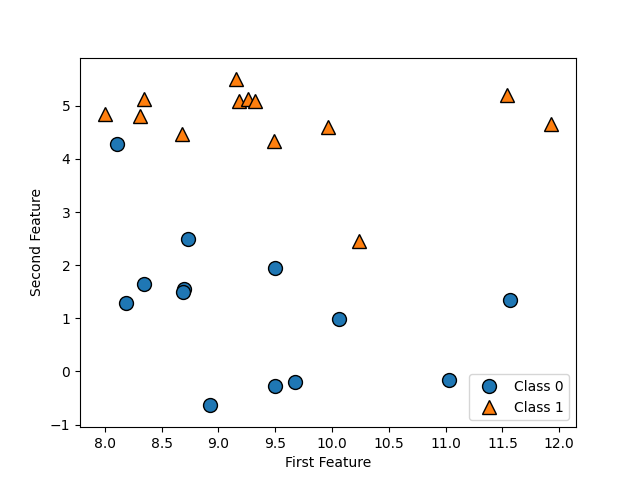
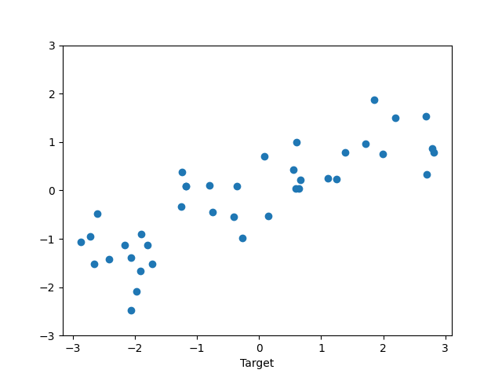

# 2.2) GENERATING DATASETS

- This part of the code will generate data sets and visualisation.

``` python
import matplotlib.pyplot as plt
from mglearn import datasets
import mglearn

# Generating Data sets dagıtık noktalar.
X, y = datasets.make_forge()
print("This is X:", X)
print("This is y:", y)

mglearn.discrete_scatter(X[:, 0], X[:, 1], y)
# Mglearn discrete_scatter makes Plots the function with classes if Y = or Y = 1
plt.legend(["Class 0", "Class 1"], loc=4)
plt.xlabel("First Feature")
plt.ylabel("Second Feature")
plt.show()

print("X shape {}".format(X.shape))

"""
--------------------------------------------------------------------------------------
"""
# Generating Wave Dataset.

X,y = datasets.make_wave(n_samples=40)
plt.plot(X,y,"o")
plt.ylim(-3,3)
plt.xlabel("Feature")
plt.xlabel("Target")
plt.show()

```
Out[1]:



<hr>
2022@CANROLLAS | CANROLLAS@gmail.com
<hr>
