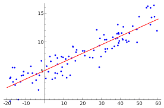
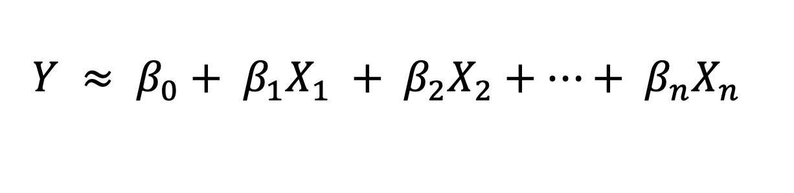

# 2.7) LINEAR MODELS
- Linear models are a class of models that are widely used in practice and have been studied extensively yin the last few decades.

- Y denotes that our prediction line.
- B0,.....,Bn is our coefficient numbers.
- X1,.....,Xn is our parameters.
Codes:
- linearmodels1.py
- linearmodels2.py

2022@CANROLLAS | CANROLLAS@gmail.com

